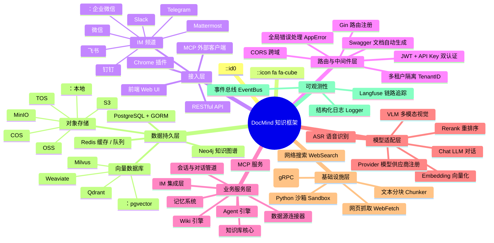
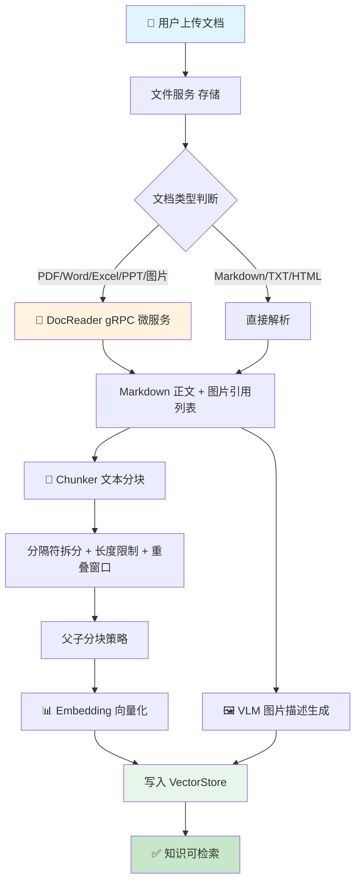
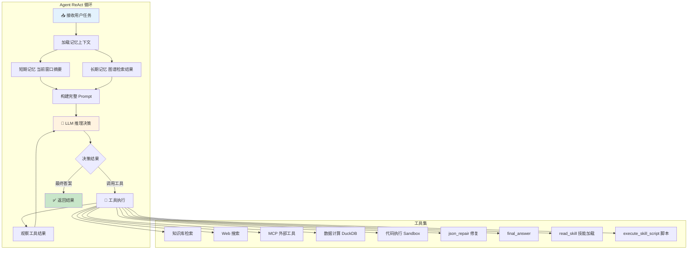
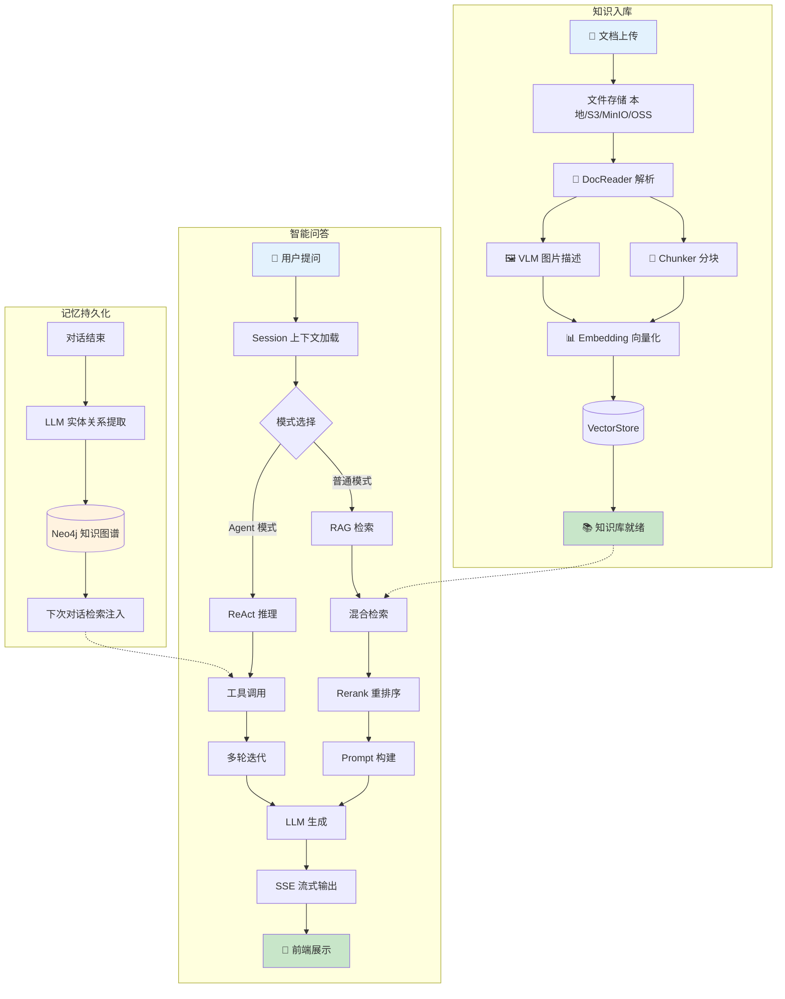
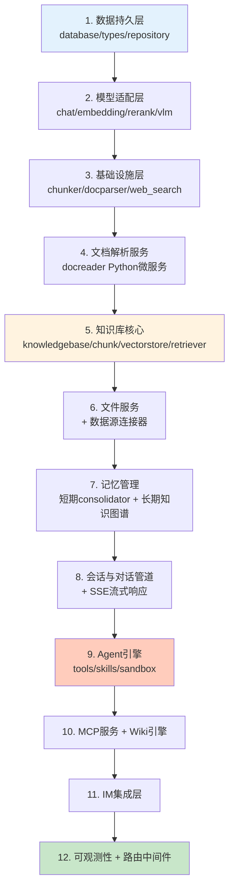

# DocMind v0.5.0 项目实现模块全景

> 面向导师的技术汇报思维导图：覆盖项目架构分层、核心模块实现逻辑、以及模块间的数据流转关系。

---

## 一、整体架构分层（总览）



---

## 二、项目骨架与基础设施

### 2.1 项目骨架

```
项目骨架
├── 配置管理 (internal/config/)
│   ├── YAML 配置文件 → config/config.yaml
│   ├── 环境变量覆盖 → .env
│   └── 核心技术: viper
├── 依赖注入容器 (internal/container/)
│   ├── 基于 uber/dig 管理全生命周期
│   └── 注册顺序: config → database → repository → service → handler
├── 统一错误体系 (internal/errors/)
│   ├── AppError 统一错误码
│   └── 全局中间件捕获 → HTTP 响应转换
├── 结构化日志 (internal/logger/)
│   └── 可配置日志级别，支持不同运行环境
└── 应用入口 (cmd/server/)
    ├── main.go → 启动 HTTP 服务
    ├── listen.go → 端口监听
    └── signals_*.go → 优雅关闭
```

### 2.2 路由与中间件

```
路由与中间件 (internal/router/ + internal/middleware/)
├── 请求链路: CORS → Auth → Tenant → Handler
├── 认证中间件
│   ├── JWT Token 认证
│   └── API Key 认证（双模式共存）
├── 多租户隔离
│   └── 请求上下文注入 TenantID，全链路数据隔离
├── Handler 层职责
│   ├── 请求参数校验与绑定
│   ├── 调用 Service 层
│   └── 格式化响应返回
└── Swagger 文档 (swaggo/swag 自动生成)
```

---

## 三、数据持久层

```
数据持久层 (internal/database/ + internal/types/ + internal/application/repository/)
├── 数据库迁移
│   ├── 自动版本化管理 → migrations/versioned/ (76个迁移脚本)
│   ├── 支持 MySQL / SQLite 多后端
│   └── 启动时自动执行未应用的迁移
├── 领域模型 (internal/types/)
│   ├── Tenant（租户）、User（用户）、Knowledge（知识条目）
│   ├── KnowledgeBase（知识库）、Chunk（分块）
│   ├── Session（会话）、Message（消息）
│   ├── Agent（智能体）、Skill（技能）
│   └── 接口定义 → internal/types/interfaces/
├── Repository 模式
│   ├── 每个 Repository 只注入 *gorm.DB
│   ├── 接口与实现分离（interfaces/ 定义契约）
│   └── 核心技术: GORM (ORM)
└── 向量数据库抽象
    ├── 统一 VectorStore 接口
    ├── 多后端支持: pgvector / Qdrant / Milvus / Weaviate
    └── 知识库级别绑定独立向量数据库实例
```

---

## 四、模型适配层

```
模型适配层 (internal/models/)
├── 设计思路
│   ├── 每种模型类型 → 统一接口定义
│   ├── Provider 工厂 → 根据配置动态创建实例
│   └── 新增厂商只需: 实现接口 + 注册 Provider
├── Chat (LLM 对话)
│   ├── 统一封装 OpenAI / Ollama 等后端
│   └── 支持 20+ 厂商: OpenAI, DeepSeek, Qwen, 智谱, 混元, Gemini, MiniMax...
├── Embedding (向量化)
│   └── 文本转向量，支撑语义检索
├── Rerank (重排序)
│   └── 对召回结果二次排序，提升检索精度
├── VLM (多模态视觉)
│   └── 图片描述生成，让纯文本 LLM 理解图片内容
├── ASR (语音识别)
│   └── 音频文件上传 → 语音转文字 → 注入知识处理流程
└── Provider 注册机制
    └── 配置文件声明模型类型 + endpoint → Provider 解析返回实例
```

---

## 五、知识处理核心管道

> 这是 DocMind 最核心的数据处理流程，从文档上传到可检索知识的完整链路。



### 5.1 知识库核心模块

```
知识库核心 (internal/application/service/)
├── KnowledgeBase 管理
│   ├── 知识库 CRUD
│   ├── 分块参数配置（大小、重叠）
│   ├── 模型选择（不同知识库绑定不同模型）
│   └── 索引策略开关: 向量 / 关键词 / Wiki / 知识图谱
├── Knowledge 知识条目
│   ├── 创建 → 解析 → 索引（全流程）
│   ├── 支持: 文件上传 / URL导入 / 文件夹批量导入 / 手动录入
│   └── 类型: FAQ（问答对）/ 文档 / Wiki
├── Chunk 分块管理
│   ├── 分块存储 + 索引状态跟踪
│   └── 父子分块: 父块保留上下文，子块精确召回
├── VectorStore 向量存储
│   ├── 统一抽象接口
│   └── 多后端: pgvector / Qdrant / Milvus / Weaviate
└── Retriever 检索器
    ├── 混合检索策略
    │   ├── 向量检索 (Dense) → Embedding 语义匹配
    │   ├── 关键词检索 (Sparse) → BM25 精确匹配
    │   └── RRF 融合算法 → 合并排序
    ├── Rerank 重排序 → 提升 Top-K 精度
    └── GraphRAG 图谱增强检索
```

### 5.2 文档解析服务（Python 微服务）

```
DocReader (docreader/ 独立 Python 项目)
├── 通信方式: gRPC (端口 50051)
├── Go 侧调用: docreader/client/client.go
├── 解析器注册表 (parser/registry.py)
│   ├── PDF → pdfplumber / markitdown
│   ├── Word → python-docx / markitdown
│   ├── Excel → openpyxl / markitdown
│   ├── PPT → python-pptx
│   ├── HTML → BeautifulSoup
│   ├── Markdown → Python markdown 库
│   ├── 图片 → OCR + VLM 描述
│   └── 链式解析器: 多种解析器依次尝试
├── OCR 模块 (ocr/)
│   ├── PaddleOCR → 通用 OCR
│   └── VLM → 多模态大模型识别
├── 文本分割 (splitter/)
│   └── 按语义边界拆分长文档
└── Docker 化部署 → Dockerfile.docreader
```

---

## 六、会话与对话管道

```mermaid
graph LR
    A[👤 用户提问] --> B[Session 会话管理]
    B --> C[Chat Pipeline 对话管道]
    C --> D[预处理插件]
    D --> E[🔍 检索插件]
    E --> F[检索相关 Chunk]
    F --> G[构建 Prompt 模板]
    G --> H[🧠 LLM 流式生成]
    H --> I[后处理插件]
    I --> J[📡 SSE 流式推送]
    J --> K[👤 前端实时渲染]
    
    style A fill:#e3f2fd
    style H fill:#fff3e0
    style K fill:#e8f5e9
```



```
会话与对话管道 (internal/application/service/session.go + chat_pipeline/)
├── Session 会话管理
│   ├── 会话 CRUD + 多轮对话上下文维护
│   ├── 对话标题自动生成（LLM 摘要）
│   └── 批量管理与删除
├── Chat Pipeline 可插拔管道
│   ├── 设计: 每个阶段是独立插件，按需组合
│   ├── 预处理 → 检索 → LLM 生成 → 后处理
│   ├── Prompt 模板可在线编辑
│   └── 检索阈值可调节
├── Stream 流式响应 (internal/stream/)
│   ├── SSE (Server-Sent Events) 协议
│   ├── 实时推送 LLM token 级别输出
│   └── 支持工具调用过程可视化
├── 对话模式切换
│   ├── 普通模式: RAG 快速问答
│   └── Agent 模式: ReAct 多步推理
└── 推荐问题生成
    └── 基于关联知识库自动生成上下文推荐
```

---

## 七、Agent 引擎

> 这是 v0.5.0 的重点模块，实现了完整的 ReAct 推理循环。



```
Agent 引擎 (internal/agent/)
├── ReAct 推理循环
│   ├── 思考 Thought → 行动 Action → 观察 Observation → 循环
│   ├── 逐步推理，支持多轮迭代
│   └── @提及范围限制: 只检索 Agent 授权的知识库
├── Tools 工具系统 (internal/agent/tools/)
│   ├── 统一 Tool 接口注册
│   ├── 内置工具
│   │   ├── knowledge_search → 知识库语义检索
│   │   ├── web_search → 多引擎网络搜索 (DuckDuckGo/Bing/Google/Tavily/Baidu)
│   │   ├── web_fetch → 网页内容抓取转 Markdown
│   │   ├── read_skill → 按需加载技能指令 / 读取技能文件
│   │   ├── execute_skill_script → 在沙箱中执行技能脚本
│   │   ├── data_schema → DuckDB 数据分析 (CSV/Excel)
│   │   ├── json_repair → 自动修复异常 JSON 输出
│   │   └── final_answer → 终止推理并给出最终答案
│   ├── MCP 工具 → 动态加载外部 MCP Server 工具
│   └── 并行工具调用: errgroup 并发执行多个工具
├── Skills 技能系统 (internal/agent/skills/)
│   ├── 设计理念: Claude Progressive Disclosure 渐进式披露
│   │   ├── Level 1 — Metadata (始终加载): name + description → 系统 Prompt
│   │   ├── Level 2 — Instructions (按需加载): SKILL.md 正文 → read_skill 工具触发
│   │   └── Level 3 — Resources (按需读取): 脚本/参考文档 → read_skill(file_path) 触发
│   ├── SKILL.md 规范与解析 (skill.go ParseSkillFile)
│   │   ├── YAML 前置元数据: name (≤64字) / description (≤1024字)
│   │   ├── Markdown 正文 = 技能指令, 由 LLM 按需读取
│   │   └── 校验规则: 名称正则 `^[\p{L}\p{N}-]+$` / 禁止 reserved 词 / 禁止 XML 标签
│   ├── 加载链: Loader → Manager (loader.go + manager.go)
│   │   ├── Loader: 递归扫描 SkillDirs → 发现 SKILL.md → 缓存 discoveredSkills
│   │   ├── Manager: 白名单过滤 → Initialize → Reload → Cleanup 生命周期
│   │   └── 路径防穿越: 校验文件绝对路径必须在技能目录内
│   ├── 系统 Prompt 集成 (prompts.go renderPromptPlaceholdersWithStatus)
│   │   ├── {{skills}} 占位符 → formatSkillsMetadata() 格式化注入
│   │   └── Skill Matching Protocol: SCAN → MATCH → LOAD → APPLY 强制匹配流程
│   ├── Agent 工具集成
│   │   ├── read_skill(skill_name, file_path?) → 读取 Instructions / 资源文件
│   │   └── execute_skill_script(skill_name, script_path, args, input)
│   │       ├── 识别脚本类型: .py(sh) / .js(ts) / .rb / .pl / .php → 沙箱执行
│   │       ├── 执行结果: stdout + stderr + exitCode + duration + killed
│   │       └── 通过 Manager.ExecuteScript → Sandbox 隔离运行
│   ├── 安全机制
│   │   ├── 白名单 (AllowedSkills): 空 = 全部允许，非空 = 仅允许列表内
│   │   ├── 脚本隔离: Docker 容器或本地沙箱执行，禁用网络
│   │   └── 参数校验: 防路径遍历、防 shell 注入
│   └── 预置技能 (skills/preloaded/)
│       ├── citation-generator → 文献引用生成
│       ├── data-processor → 数据分析 (含 scripts: analyze/extract/format_converter.py)
│       ├── doc-coauthoring → 文档协作编写
│       ├── document-analyzer → 文档分析
│       └── openmaic-classroom → 教学技能 (含 scripts + references)
├── Sandbox 沙箱 (internal/sandbox/)
│   ├── Python 代码安全隔离执行
│   ├── Docker 容器沙箱
│   └── 用于数据分析、代码执行等需要运行时的工具
└── Token 管理 (internal/agent/token/)
    └── Token 估算器 → 精确控制上下文窗口
```

---

## 八、记忆系统

```
记忆系统 (双层架构)
│
├── 📝 短期记忆 Working Memory (internal/agent/memory/consolidator.go)
│   ├── 解决的问题: LLM 上下文窗口有限
│   ├── Token 预算管理
│   │   ├── 持续追踪消息 Token 数
│   │   └── 超过阈值 50% 时触发压缩
│   ├── 压缩策略
│   │   ├── 保留: system prompt + 最近 N 条历史 + 当前轮次
│   │   ├── 压缩: 旧消息 → LLM 摘要 → Memory Summary 系统消息
│   │   └── 保护: tool_call/tool_result 不被打断
│   └── 降级机制: LLM 摘要失败 → 原始文本归档
│
└── 🧠 长期记忆 Persistent Memory (internal/application/service/memory/)
    ├── 解决的问题: 跨会话记忆持久化
    ├── 知识图谱存储
    │   ├── 对话结束 → LLM 提取 (实体, 类型, 描述) + (关系)
    │   ├── 存储: Episode 记忆片段 → Neo4j 图数据库
    │   └── 结构: Entity 节点 + Relationship 边
    ├── 检索机制
    │   ├── 用户 query → 提取关键词 → 图谱匹配实体
    │   ├── 返回关联 Episode → 作为 MemoryContext
    │   └── 注入 Agent 上下文辅助推理
    └── 可视化: 前端记忆图谱预览
```

---

## 九、Wiki 引擎

```
Wiki 引擎 (internal/application/service/)
├── wiki_ingest.go → 批量导入 Markdown 文档到 Wiki 知识库
├── wiki_linkify.go → 自动识别 [[页面名]] Wiki 链接格式
├── wiki_lint.go → Wiki 内容检查与修正
├── wiki_page.go → Wiki 页面 CRUD
├── 核心能力
│   ├── Agent 驱动: 从原始文档自动生成结构化 Markdown 页面
│   ├── 知识互联: 自动建立页面间的引用与关联
│   ├── 可视化: 内置 Wiki 浏览器 + 知识图谱关系图
│   └── 迭代演进: 支持持续更新与维护
└── 解析流程
    ├── 解析 Markdown → 提取 Wiki 链接 → 修复失效引用 → 分块索引
    └── 批量导入支持
```

---

## 十、集成与扩展层

### 10.1 数据源连接器

```
数据源连接器 (internal/datasource/connector/)
├── 统一接口: DataSourceConnector
│   ├── 认证 OAuth2
│   ├── 拉取文档列表
│   ├── 下载文档
│   └── 导入知识库
├── Notion 连接器
├── 飞书连接器 (Wiki / 云文档)
├── 语雀连接器 (v0.5.0 新增)
├── 调度器 scheduler.go
│   ├── cron 定时触发同步
│   └── 支持全量 + 增量同步
└── 同步日志 + 租户隔离
```

### 10.2 IM 集成层

```
IM 集成层 (internal/im/)
├── 统一接口: IMAdapter
│   ├── 发送消息
│   ├── 接收回调 Webhook
│   └── 格式转换 (IM ↔ 内部 Message)
├── 已集成平台 (7个)
│   ├── 企业微信 wecom
│   ├── 飞书 feishu
│   ├── Slack
│   ├── Telegram
│   ├── 钉钉 dingtalk
│   ├── Mattermost
│   └── 微信 wechat (扫码登录 + 长轮询)
├── 高级特性
│   ├── 线程会话模式 (thread 维度独立会话)
│   ├── 引用回复上下文注入
│   ├── 斜杠命令框架 (/help /search /stop /clear)
│   └── QA 工作池 + 用户级限流 + Redis 分布式协调
└── 流式回复: 支持分平台流式输出 (如 Telegram editMessageText)
```

### 10.3 MCP 服务

```
MCP 服务 (internal/mcp/ + mcp-server/)
├── MCP Server (对内暴露)
│   ├── 将 DocMind 能力包装为 MCP tools/resources
│   ├── 支持 stdio / SSE 传输协议
│   ├── 供 Claude Desktop 等外部 MCP Client 调用
│   └── 工具名称稳定性: 基于 service.Name 跨重连保持
├── MCP Client (对外调用)
│   ├── 动态加载外部 MCP Server 工具
│   ├── 自动重连机制
│   └── 支持 uvx / npx 启动工具
└── MCP Server Python 包 (mcp-server/)
    ├── 可独立 pip install 发布
    └── 让 DocMind 作为外部知识库服务
```

---

## 十一、可观测性

```
可观测性 (internal/tracing/ + internal/event/)
├── Langfuse 全链路追踪 (internal/tracing/langfuse/)
│   ├── Agent ReAct 循环追踪
│   ├── LLM Token 消耗统计
│   ├── 工具调用耗时记录
│   └── asynq 任务流水线监控
├── 事件总线 (internal/event/)
│   ├── 发布-订阅模式
│   ├── 异步通知状态变更
│   └── 事件类型: 知识库更新、索引完成等
├── 结构化日志 (internal/logger/)
│   └── 可配置日志级别
└── 调试支持
    ├── llm_debug 模式
    └── 所有模型厂商请求日志
```

---

## 十二、核心数据流全景

> 从知识入库到智能问答的完整链路。



---

## 十三、技术栈全景

```
技术栈总览
├── 后端语言: Go 1.24
│   ├── HTTP框架: Gin
│   ├── ORM: GORM
│   ├── 依赖注入: uber/dig
│   └── 配置管理: viper
├── 微服务: gRPC (Go ↔ Python DocReader)
├── Python 服务: DocReader (文档解析)
│   ├── 包管理: uv
│   ├── 解析库: pdfplumber, python-docx, markitdown
│   └── OCR: paddleocr, VLM
├── 数据库
│   ├── 主库: PostgreSQL
│   ├── 向量: pgvector / Qdrant / Milvus / Weaviate
│   ├── 图库: Neo4j (知识图谱)
│   └── 缓存: Redis (会话/队列/限流)
├── 对象存储: 本地 / MinIO / S3 / OSS / COS / TOS
├── 前端: Vue 3 + TypeScript + Vite
├── 可观测性: Langfuse + Jaeger
├── 任务队列: asynq (基于 Redis)
├── 容器化: Docker + Docker Compose
├── 编排: Kubernetes (Helm Chart)
└── 部署: 本地 / 私有云 / 离线
```

---

## 十四、模块依赖关系（开发顺序视角）



---

> **设计说明**: 本思维导图采用"总-分-总"结构。先展示整体架构分层（Mermaid 脑图），再逐模块拆解实现逻辑（文字树形图），最后通过数据流全景图和依赖关系图展示模块间的协作关系。适合导师快速理解项目的模块组成、技术选型和核心实现逻辑。
